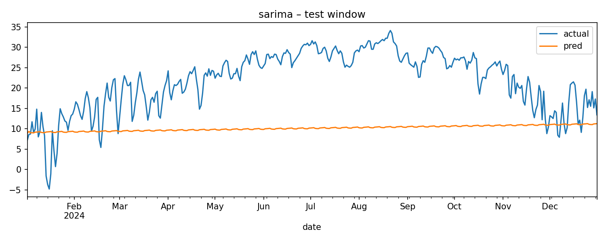

# Weather Insights

A tidy, reproducible pipeline for daily weather: ingest → preprocess → backtest baselines/SARIMA/ML → Streamlit dashboard.

## TL;DR
- **SARIMA** beats seasonal naive by ~X% RMSE on Austin test set (last 365 days).
- **Ridge ML** with lag/rolling/calendar features matches SARIMA within error bars and trains in seconds.

## How to run
python -m venv .venv
.venv\Scripts\activate
pip install -r requirements.txt

python -m src.ingest --location "Austin,US" --start 2018-01-01 --end 2024-12-31 --outfile data/raw/austin_2018_2024.csv
python -m src.preprocess --in data/raw/austin_2018_2024.csv --out data/processed/austin_proc.csv
python -m src.modeling.backtest --dataset data/processed/austin_proc.csv --model sarima --horizon 7

streamlit run app/streamlit_app.py

## Repo layout
weather-insights/
data/{raw,processed,external}
src/{ingest.py,preprocess.py,modeling/,viz.py,utils.py}
app/streamlit_app.py
reports/{figures,metrics}
tests/
.github/workflows/ci.yml

## Results
| model           | MAE | RMSE |
|-----------------|-----|------|
| seasonal_naive  | ... | ...  |
| sarima          | ... | ...  |
| ridge_ml        | ... | ...  |

## Notes
- Weekly seasonality is strong; SARIMA captures it.
- Simple ML with lags/rolls/calendar nearly ties SARIMA.
